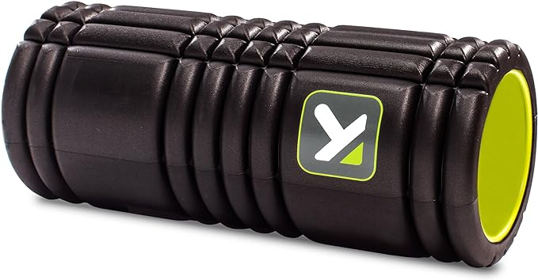

# トリガーポイント グリッドフォームローラー：究極のセルフマッサージツール

[トリガーポイント グリッドフォームローラーを今すぐチェック！](https://amzn.to/3xMNfmi)

フィットネス愛好家やアスリートの皆さん、筋肉の疲労回復や柔軟性の向上にお悩みではありませんか？今回は、セルフケアの強い味方「トリガーポイント グリッドフォームローラー」をご紹介します。

## グリッドフォームローラーの特徴

1. 独自のグリッドデザイン：表面の凹凸が様々な圧力を与え、効果的な筋膜リリースを実現
2. 耐久性抜群：強化コアと高密度EVAフォームで、180kgの体重にも耐える頑丈さ
3. コンパクトサイズ：長さ33cm、直径14cmで持ち運びや収納に便利
4. 日本語ガイドブック付き：初心者でも安心して使用できる、詳細な使用方法を解説
5. 環境に配慮：フタル酸エステル、ラテックス不使用の安全素材

## なぜグリッドフォームローラーが選ばれるのか？

トリガーポイントのグリッドフォームローラーは、その効果と使いやすさで多くのユーザーから支持されています。独自のグリッドデザインにより、深部の筋肉まで届くマッサージ効果を実現。さらに、コンパクトなサイズながら高い耐久性を持ち、長期間使用できるのも魅力です。

[今すぐグリッドフォームローラーをチェック！](https://amzn.to/3xMNfmi)

## ユーザーの声

Amazonのレビューでは、多くの方が高評価を付けています。

「トレーニング後の疲労回復が早くなった気がします。特に背中と太ももの張りが軽減されます」（30代男性）

「コンパクトで持ち運びやすく、出張先でも使えるのが良いです」（40代女性）

「初めは痛みを感じましたが、慣れてくると心地よくなりました。毎日の習慣になっています」（20代男性）

## 効果的な使用方法

1. 背中のリリース：ローラーの上に寝転がり、ゆっくりと上下に動かす
2. 太もものケア：太ももの外側をローラーに乗せ、前後に動かす
3. ふくらはぎのマッサージ：ふくらはぎをローラーに乗せ、足を左右に動かす
4. 肩甲骨周りのリリース：壁に寄りかかるようにローラーを使用
5. 腰のケア：腰の左右をそれぞれローラーに乗せ、前後に動かす

## 安全性と品質

トリガーポイントは品質管理に厳しく、安全性の高い素材を使用しています。フタル酸エステルやラテックスを使用していないため、肌に優しく、アレルギーの心配も少ないです。また、180kgまでの耐荷重があり、どなたでも安心して使用できます。

## まとめ

トリガーポイント グリッドフォームローラーは、自宅で手軽に行えるセルフケアツールとして最適です。トレーニングの質を上げたい方、日々の疲労回復を効率的に行いたい方にとって、必携のアイテムと言えるでしょう。

独自のグリッドデザイン、高い耐久性、そして使いやすさ。これらすべてを兼ね備えたグリッドフォームローラーは、あなたのフィットネスライフを強力にサポートします。日本語ガイドブック付きなので、初心者の方でも安心して使用できます。今すぐ試してみて、その効果を実感してください！

[トリガーポイント グリッドフォームローラーで究極のセルフケアを！](https://amzn.to/3xMNfmi)
