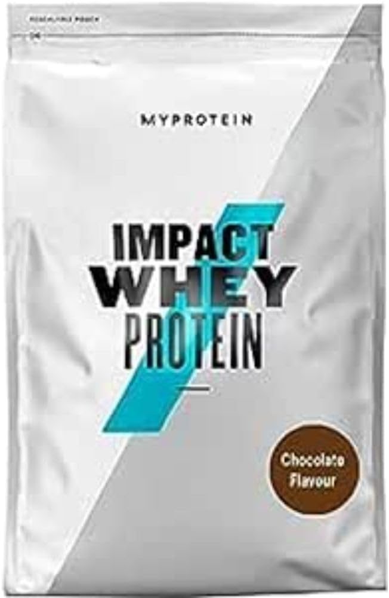

## プロテインのベストタイミングを探る！筋トレ男子と栄養士の奮闘記

健太（筋トレ愛好家の大学生）：「よし、今日もジムでバリバリ鍛えてきたぞ！さあ、プロテインだ！」

美咲（栄養士の先輩）：「あら、健太くん。トレーニング直後にプロテイン？それって本当に効果的なの？」

健太：「え？トレーニング後じゃダメなんですか？」

美咲：「いえいえ、そんなことはないわ。でも、プロテインを摂るタイミングについては、色々な考え方があるのよ。」

健太：「へぇ、そうなんですか？詳しく教えてください！」

美咲：「まず、トレーニング直後にプロテインを摂ることは悪くないわ。筋肉の修復と成長を促進するには、運動後30分以内にタンパク質を摂取するのが良いという考え方があるの。」

健太：「やっぱり！僕の方法は間違ってなかったんだ！」

美咲：「でも、最近の研究では、1日を通じてバランス良くタンパク質を摂取することの重要性も指摘されているのよ。」

健太：「え？それってどういうことですか？」

美咲：「つまり、朝・昼・晩の食事でタンパク質をしっかり摂り、さらに間食としてプロテインを追加するという方法もあるの。これにより、筋肉の合成が1日中継続的に行われるんだとか。」

健太：「なるほど。でも、寝る前にプロテインを飲むのはNG...ですよね？」

美咲：「実は、就寝前のプロテイン摂取も効果があるという研究結果もあるのよ。夜間の筋肉修復を助けるんだって。」

健太：「えー！そうなんですか？でも、太っちゃいそう...」

美咲：「カロリー管理さえしっかりしていれば大丈夫よ。ただし、就寝前は消化に良いカゼイン系のプロテインがおすすめね。」

健太：「へぇ〜。プロテインにもいろんな種類があるんですね。」

美咲：「そうよ。ホエイプロテインは吸収が早いから運動前後に、カゼインは吸収が遅いから就寝前に、というように使い分けるのが理想的ね。」

健太：「なるほど！でも結局、いつ飲めばいいんですか？」

美咲：「結論から言うと、自分のライフスタイルに合わせて飲むのが一番いいわ。トレーニング後、朝食代わり、間食、就寝前...どのタイミングでも、定期的にタンパク質を摂取することが大切なの。」

健太：「わかりました！僕は今まで通りトレーニング後に飲みつつ、朝食でもプロテインを取り入れてみます！」

美咲：「その調子よ！でも忘れないでね。プロテインは補助食品。バランスの取れた食事が基本だということを。」

健太：「はい、わかりました！ありがとうございます、美咲さん！」

## おすすめプロテイン：マイプロテイン Impact ホエイプロテイン

対話の最後に、美咲さんが健太くんにおすすめのプロテインを紹介します：

美咲：「健太くん、プロテインを選ぶなら、私がいつも愛用している『UltraFit プレミアムブレンド』がおすすめよ。ホエイとカゼインのブレンドだから、吸収の速さが異なるタンパク質をバランスよく摂取できるの。」

健太：「へぇ、それは便利そうですね！」

美咲：「そうなの。しかも、BCAAを含む9種類の必須アミノ酸をバランス良く配合されていて、飲みやすいチョコレート味なのよ。きっと健太くんの好みなはず。」

健太：「わぁ、とても良さそう！僕も試してみます！」

[マイプロテイン Impact ホエイプロテインを今すぐチェック！](https://amzn.to/3zxzjNA)

この対話を通じて、プロテインの摂取タイミングについての様々な考え方や最新の研究結果を紹介しました。読者の方々には、自分のライフスタイルに合わせて最適なタイミングを見つけていただければと思います。
